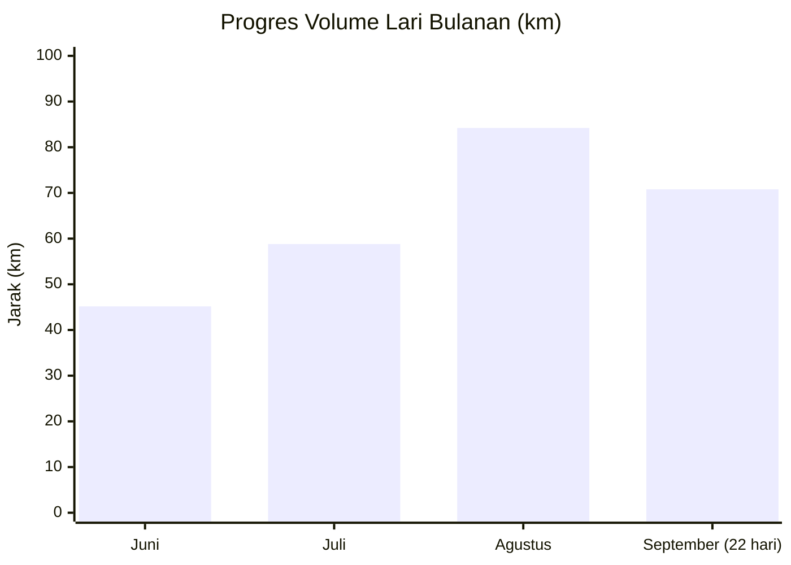

# Laporan Analisis & Evaluasi Latihan Lari Mendalam (Juni – Oktober 2026)

Laporan ini disusun berdasarkan tinjauan historis dari **52 sesi lari (.fit files)** selama 4-5 bulan terakhir (5 Juni 2026 s/d awal Oktober 2026). Data mentah telah berhasil diekstrak dan disimpan dalam format CSV. Laporan ini bersifat statis dan mendalam untuk merekam tonggak pencapaian historis Anda.

---

## 1. Ringkasan Eksekutif (Total Metrik Keseluruhan)

| Metrik | Nilai | Keterangan |
| :--- | :--- | :--- |
| **Total Sesi Lari** | **52 sesi** | Rata-rata ~3 sesi per minggu secara konsisten |
| **Total Jarak Tempuh** | **273.03 km** | Semakin jauh dan terukur |
| **Total Waktu Latihan** | **38 jam 40 menit** | Investasi waktu latihan kardiovaskular |
| **Total Kalori Terbakar** | **~24,120 kcal** | Rata-rata 460+ kcal per sesi |
| **Rata-rata Jarak per Sesi** | **5.25 km** | Stabil di rentang jarak 5K-10K |
| **Overall Weighted Pace** | **8:29 /km** | Pace rata-rata tertimbang seluruh jarak |
| **Rata-rata Detak Jantung** | **150.6 bpm** | Zona Aerobik / Tempo terkendali |
| **Max Detak Jantung** | **187 bpm** | Dicapai pada sesi tempo intensif awal Juni |
| **Rata-rata Kadensi** | **148.4 spm** | Meningkat pesat sejak bulan-bulan awal |
| **Jarak Terjauh (Long Run)** | **17.09 km** | Edisi Kemerdekaan (17 Agustus 2026) |
| **5K Tercepat (Personal Best)** | **31:48 (Pace 6:20)** | 27 September 2026 (PLN Mobile Electric 5K) |

---

## 2. Progres Bulanan (Volume, Intensitas, & Efisiensi)

Pertumbuhan performa dari bulan ke bulan menunjukkan tren adaptasi fisik yang luar biasa:

| Bulan | Jumlah Sesi | Total Jarak (km) | Rerata Jarak (km) | Long Run Terpanjang | Rerata Pace | Rerata HR (bpm) | Efisiensi (EF)* | Rerata Kadensi (spm) |
| :--- | :---: | :---: | :---: | :---: | :---: | :---: | :---: | :---: |
| **Juni 2026** | 10 | 45.17 km | 4.52 km | 5.61 km | 9:36 /km | 148.7 bpm | 0.70 | 135.5 spm |
| **Juli 2026** | 11 | 58.81 km *(+30%)* | 5.35 km | 10.03 km | 8:42 /km | 150.9 bpm | 0.76 | 149.5 spm |
| **Agustus 2026**| 16 | 84.22 km *(+43%)* | 5.26 km | 17.09 km | 8:15 /km | 152.1 bpm | 0.81 | 150.6 spm |
| **September 2026**| 12** | 70.78 km | 5.90 km | 13.01 km | 8:09 /km | 148.0 bpm | 0.84 | 152.1 spm |

*\*EF (Efficiency Factor) = (Kecepatan m/menit) / Detak Jantung rata-rata. Semakin tinggi angka EF, semakin banyak jarak yang ditempuh per detak jantung (indikator kapasitas aerobik yang membaik).*
*\*\*Data September sampai dengan tanggal 22 September (proyeksi ~96 km bila genap 30 hari).*

---

## 3. Analisis Fisiologis & Adaptasi Aerobik

> [!NOTE]
> **Penurunan Pace Tanpa Peningkatan Detak Jantung:**
> Di bulan Juni, detak jantung rata-rata Anda berada di angka **148.7 bpm** dengan pace **9:36 /km**. Di bulan September, detak jantung rata-rata Anda justru sedikit menurun ke **148.0 bpm**, tetapi pace rata-rata Anda melesat kencang menjadi **8:09 /km**!

Hal ini menunjukkan **adaptasi kardiovaskular tingkat tinggi**:
1. **Stroke Volume Jantung Meningkat**: Jantung memompa volume darah beroksigen lebih banyak per detak.
2. **Kepadatan Mitokondria & Kapilarisasi Otot Meningkat**: Otot kaki Anda jauh lebih efisien menggunakan oksigen untuk membakar energi pada pace sub-8:00.
3. **Peningkatan Efisiensi Aerobik (+20%)**: Skor efisiensi Anda naik dari **0.70** (Juni) menjadi **0.84** (September).

### Distribusi Zona Detak Jantung
- **Juni & Juli**: Menghabiskan 23% – 30% waktu di Zone 4 (Threshold) dan ~5% di Zone 5 karena tubuh masih beradaptasi dengan beban lari.
- **September**: Waktu di Zone 5 turun ke **0.05%** dan Zone 3 (Aerobic Base) menjadi zona dominan (38.9%). Ini menandakan lari pada pace 7:30 - 8:00 sudah mulai menjadi *"comfort zone"* aerobik Anda, bukan lagi kondisi stres anaerobik.

---

## 4. Analisis Teknik & Mekanika Lari (Kadensi / SPM)

- **Awal Latihan (Juni):** Rata-rata kadensi berada di **135.5 spm** (bahkan sempat berada di 115 - 120 spm pada beberapa sesi). Ini adalah tanda khas *overstriding* (langkah terlalu panjang dengan frekuensi rendah), yang cenderung membebani lutut dan engsel pergelangan kaki.
- **Akhir Latihan (Agustus – September):** Rata-rata kadensi meningkat signifikan ke **150.6 – 152.1 spm**, dengan sesi tempo/lari cepat mencapai **161 – 163 spm** (contoh: lari 5.04k PB tanggal 30 Agustus di 161.6 spm, dan lari 5.3k tanggal 22 September di 161.0 spm).
- **Dampak Mekanikal:** Waktu kontak kaki dengan tanah (*ground contact time*) semakin singkat, dorongan langkah lebih efisien, dan risiko cedera berkurang.

---

## 5. Milestone & Rekor Terbaik (Personal Bests)

### Lari Jarak Terjauh (Top Long Runs)
1. **17.09 km** | `02:39:37` | Pace 9:20 | HR 148 bpm *(17 Agustus 2026 - Spesial HUT RI)*
2. **13.01 km** | `01:51:40` | Pace 8:34 | HR 150 bpm *(13 September 2026)*
3. **10.03 km** | `01:27:16` | Pace 8:42 | HR 157 bpm *(23 Juli 2026 - Milestone 10K pertama)*
4. **8.25 km** | `01:00:41` | Pace 7:21 | HR 168 bpm *(29 Agustus 2026)*
5. **7.40 km** | `00:57:41` | Pace 7:47 | HR 154 bpm *(10 September 2026)*

### Sesi Lari Tercepat (Fastest 5K / Pace)
1. **5.01 km** – `31:48` (**Pace 6:20 /km**, HR 167, Cadence 164.0 spm) – *27 September 2026 (Race TMII)* 🏆 PB!
2. **5.04 km** – `33:33` (**Pace 6:39 /km**, HR 164, Cadence 161.6 spm) – *30 Agustus 2026*
3. **5.15 km** – `36:53` (**Pace 7:09 /km**, HR 159, Cadence 158.1 spm) – *03 September 2026*
4. **5.30 km** – `38:17` (**Pace 7:13 /km**, HR 156, Cadence 161.0 spm) – *22 September 2026*
5. **5.63 km** – `41:01` (**Pace 7:17 /km**, HR 161, Cadence 161.9 spm) – *25 September 2026*

---

## 6. Pola Kebiasaan & Periodisasi Latihan

- **Waktu Latihan Favorit:**
  - **Sore Hari (15:00 – 18:00):** 35 sesi (71.4%) — menjadi waktu utama untuk rutinitas lari harian.
  - **Pagi Hari (05:00 – 09:00):** 11 sesi (22.4%) — hampir selalu digunakan untuk sesi kunci akhir pekan / *long run* (17 km, 13 km, 8.2 km, dan 6 km).
  - **Malam Hari (18:00 – 22:00):** 3 sesi (6.2%).
- **Frekuensi & Pola Recovery:**
  - 19 sesi dijalankan *back-to-back* (hari berturut-turut).
  - 14 sesi dijalankan dengan jeda 1 hari istirahat.
  - Anda memiliki kepekaan tubuh yang sangat baik dalam menyisipkan **Recovery Runs** (misal: 3-4 km di pace 9:15 - 9:50 dengan HR rendah 131-137 bpm setelah sesi berat), yang mempercepat pemulihan laktat otot.

---

## 7. Evaluasi & Rekomendasi untuk Siklus Latihan Berikutnya

> [!TIP]
> **Rekomendasi 1: Tingkatkan Cadence secara Bertahap ke 165 – 175 SPM**
> Kadensi Anda sudah naik dari 135 ke 152 spm. Untuk mencapai efisiensi lari terbaik dan meminimalkan beban benturan pada sendi lutut, cobalah latihan lari dengan langkah lebih rapat dan frekuensi lebih cepat (*quick feet*). Gunakan metronom lari atau playlist bertempo 165 - 170 BPM.

> [!TIP]
> **Rekomendasi 2: Penerapan Polarisasi 80/20 (Easy vs Hard)**
> Pastikan 80% dari total kilometer mingguan Anda berada di zona mudah/ringan (Zone 2, detak jantung < 140 bpm, pace santai di mana Anda bisa bernapas hidung atau berbicara penuh). Sisakan 20% kilometer untuk sesi kualitas (Interval / Tempo di pace 6:30 - 7:00). Hal ini mencegah penumpukan kelelahan laten.

> [!IMPORTANT]
> **Rekomendasi 3: Kesiapan Menuju Half Marathon (21.1 km)**
> Anda sudah sukses menyelesaikan **17.09 km** dengan aman di bulan Agustus dan **13.01 km** di bulan September. Fondasi aerobik dan daya tahan Anda sudah lebih dari 80% siap untuk menyelesaikan ajang lomba **Half Marathon resmi (21.1 km)** dengan target finish yang sangat realistis di kisaran waktu **02:40:00 – 02:55:00**.
